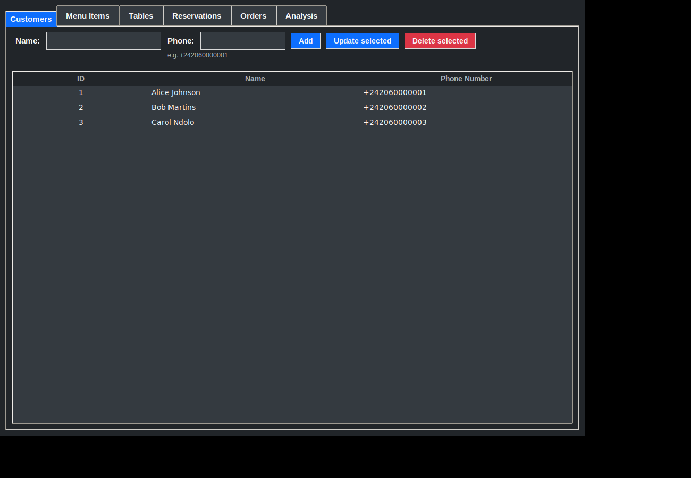
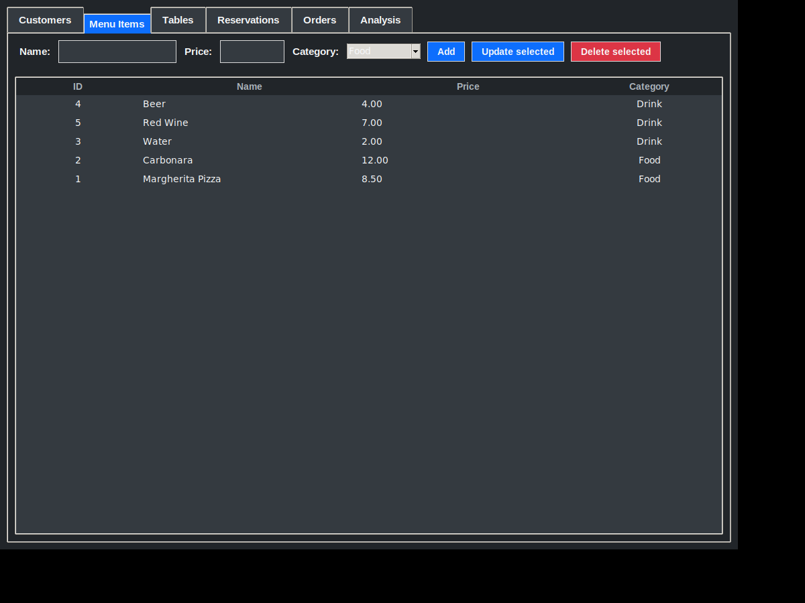
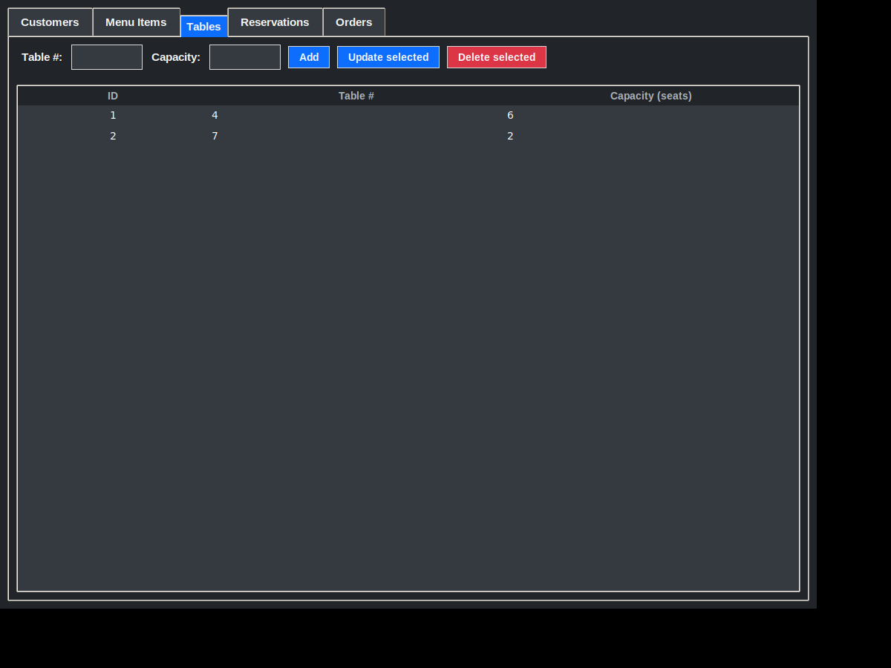
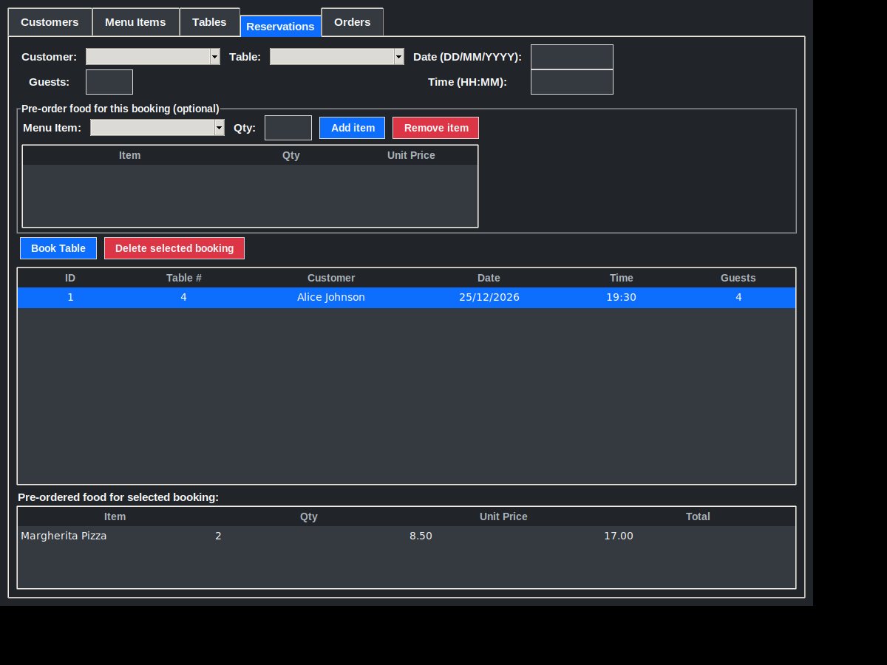
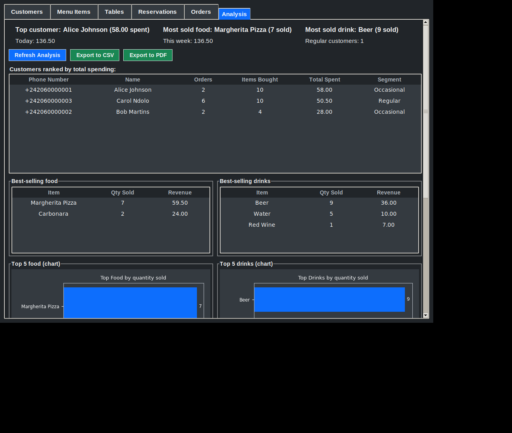

# Restaurant Management System

A desktop application for managing restaurant customers, menu items, and orders, built with **Python**, **tkinter/ttk**, and **SQLite**.







## Features

- **Customers** — add, edit, and delete customer records, each with a **unique phone number** (validated as `+242XXXXXXXXX` and enforced unique at the database level) used to identify repeat customers across visits
- **Menu Items** — add, edit, and delete dishes and drinks, each tagged with a **category** (Food / Drink) that powers the analysis tab
- **Tables** — manage the restaurant's physical tables (number + seating capacity)
- **Reservations** — book a table for a customer at a given date/time, with a live conflict check (can't double-book the same table at the same slot) and a soft warning if the party size exceeds the table's capacity. Food can optionally be pre-ordered as part of the booking itself.
- **Orders** — place a walk-in order by linking a customer + menu item + quantity, view every order in a sortable table, and see live **total revenue**
- **Analysis** — a dedicated dashboard:
  - Customers ranked by total spending (grouped by phone number), each tagged **Regular** or **Occasional** based on order count
  - Revenue broken down by **today**, **this week**, and **all-time**
  - Best-selling food and best-selling drinks, as both exact-number tables and embedded **matplotlib bar charts**
  - A **7-day revenue trend** chart
  - **Export the full report to CSV or PDF** with one click
  - Refreshes automatically whenever the tab is opened
- Deleting a customer, menu item, or table automatically removes their related orders/reservations (`ON DELETE CASCADE`); deleting a reservation keeps any food that was pre-ordered for it but unlinks it (`ON DELETE SET NULL`), so history is never silently lost
- Dark, modern UI theme built on `ttk.Style`, extended to the embedded charts and exported PDF
- Input validation on every form (empty fields, invalid numbers, non-positive prices/quantities, malformed dates/times, duplicate or malformed phone numbers)

## Project structure

```
restaurant-manager/
├── database.py     # SQLite access layer (Database class + dataclasses)
├── ui.py            # tkinter/ttk interface (RestaurantApp class)
├── main.py           # entry point
├── requirements.txt
├── .gitignore
├── tests/
│   └── test_database.py   # pytest suite for the data layer
└── screenshots/
```

The database logic and the UI are kept in separate modules on purpose: `database.py` has no dependency on tkinter at all, which is what makes it possible to unit-test it directly (see `tests/`) without opening a single window.

## Getting started

```bash
git clone <this-repo-url>
cd restaurant-manager
pip install -r requirements.txt   # matplotlib + reportlab (Analysis tab) and pytest (tests)
python main.py
```

`tkinter` and `sqlite3` ship with the Python standard library. `matplotlib` (charts) and `reportlab` (PDF export) are the only two runtime dependencies the Analysis tab needs — everything else runs with just the standard library.

If you already have a `restaurant.db` from an earlier version of this project, it's migrated automatically the first time you run the updated app — no need to delete it (phone numbers and categories will just be empty/"Food", and existing orders will be backfilled with the migration date, until you fill things in going forward).

## Running the tests

```bash
pytest tests/ -v
```

35 tests cover customer/menu item/order/table/reservation CRUD operations, cascading deletes, table double-booking prevention, reservation-linked pre-orders, revenue calculation (all-time, today, this week, daily breakdown), phone number uniqueness, and customer segmentation — all running against an in-memory SQLite database (`:memory:`), so tests never touch `restaurant.db`.

## Tech stack

- Python 3.12
- tkinter / ttk (standard library)
- SQLite (standard library, via `sqlite3`)
- matplotlib (charts embedded in the Analysis tab)
- reportlab (PDF report export)
- pytest (for the test suite)

## Possible improvements

- Search/filter bar on the Orders and Reservations tables (by customer or date range)
- A visual floor plan / calendar view for table availability
- Packaging as a standalone executable (`pyinstaller`)
- Basic user authentication if this were ever used by multiple staff members
- Configurable "Regular customer" threshold from the UI instead of a constant in `database.py`
- A longer revenue trend window (30/90 days) with a date-range picker
